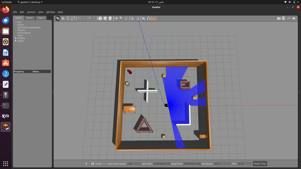
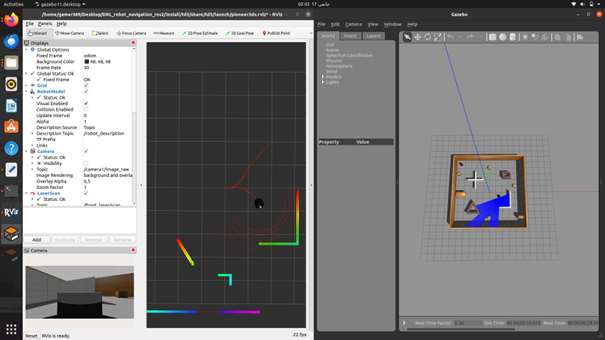

# Autonomous-maze-solving-robot-using-Reinforcement-Learning
  ## Démarche :
1. Installation de ROS2 Foxy.
2.	Installation de Gazebo Simulator.
3. Installation de Colcon  Builder.
4.	Création de l'architecture du projet et génération des meshes avec Gazebo.
5.	Construction du projet avec Colaban .
6.	Exécution du projet.

  ## Installation de ROS2 Foxy :
mettre à jour le système ( il faut que la version utiliser est ubuntu 20.04 avec version python >=3.8.12 )
* Commande de mise à jour
```bash
sudo apt update && sudo apt upgrade
```
* Installation de ROS2 Foxy Desktop
```bash
sudo apt install ros-foxy-desktop python3-argcomplete
```
* Installation et initialisation de rosdep
```bash
sudo apt update
sudo apt install -y python-rosdep
sudo rosdep init
rosdep update
```
* Installation des dépendances manquantes 
rosdep install --from-paths ~/ros2_dashing/ros2-linux/share --ignore-src --rosdistro dashing -y --skip-keys "console_bridge fastcdr fastrtps libopensplice67 libopensplice69 osrf_testing_tools_cpp poco_vendor rmw_connext_cpp rosidl_typesupport_connext_c rosidl_typesupport_connext_cpp rti-connext-dds-5.3.1 tinyxml_vendor tinyxml2_vendor urdfdom urdfdom_headers"
```bash
rosdep install --from-paths ~/ros2_dashing/ros2-linux/share --ignore-src --rosdistro dashing -y --skip-keys "console_bridge fastcdr fastrtps libopensplice67 libopensplice69 osrf_testing_tools_cpp poco_vendor rmw_connext_cpp rosidl_typesupport_connext_c rosidl_typesupport_connext_cpp rti-connext-dds-5.3.1 tinyxml_vendor tinyxml2_vendor urdfdom urdfdom_headers"
```
* Installation des bibliothèques python3
```bash
sudo apt install -y libpython3-dev python3-pip
pip3 install -U argcomplete
```
* Installation des outils du développement du ROS
```bash
sudo apt install ros-dev-tools
```
  ## Installation gazebo et les modules nécessaires
* Installation gazebo pour ROS2 Foxy
  
* Installation gazebo robot localisation package
```bash
sudo apt install ros-foxy-gazebo-ros-pkgs
```
* Installation gazebo robot localisation package
```bash
sudo apt install ros-foxy-robot-localization
```
* Installation ROS2 Foxy control
```bash
sudo apt install ros-foxy-ros2-control
```
* Installation ROS2 Foxy controllers
```bash
sudo apt install ros-foxy-ros2-controllers
```
  ## Création du maquette et du robot:
   # Robot :
 Le modèle de robot décrit dans le fichier SDF est destiné à être utilisé dans des simulations avec Gazebo. Il est nommé "td_robot" et se compose principalement d'un composant central appelé "base_link", représentant le châssis du robot. Ce châssis a des propriétés inertielles, définies par sa masse et son tensor d'inertie, qui influencent sa dynamique lors de la simulation.

Le châssis est équipé de plusieurs capteurs, notamment des caméras ("camera1" et "camera2"), un lidar Velodyne VLP-16 ("velodyne-VLP16"), et un capteur de distance de type rayon ("laser"). Ces capteurs sont essentiels pour simuler la perception de l'environnement par le robot. Les informations recueillies par ces capteurs sont utilisées pour générer des données de profondeur, d'images, de balayages laser, et de points Lidar, fournissant ainsi une représentation virtuelle de l'environnement du robot.

Le robot est également doté de roues pour la mobilité, avec des articulations de type "revolute" modélisant les liaisons entre les différentes parties mobiles. Les roues gauche et droite sont respectivement attachées aux joints "left_hub_joint" et "right_hub_joint", permettant au robot de se déplacer de manière différentielle. Le contrôle de la mobilité est assuré par le plugin "differential_drive_controller", qui gère les commandes de vitesse des roues en réponse aux commandes de déplacement du robot.

En plus des composants fonctionnels, le modèle inclut des représentations visuelles et de collision pour chaque composant, définissant l'apparence graphique du robot dans la simulation. Ces représentations visuelles sont associées à des matériaux spécifiques, indiquant les propriétés visuelles telles que la couleur et la texture.
  # Maquette :
 La maquette de l'environnement dans lequel le robot "td_robot" évolue est conçue pour simuler des scénarios diversifiés avec différents types d'obstacles. Les obstacles sont représentés par des éléments variés tels que des blocs en plastique, des boîtes en carton, et d'autres objets imitant des structures diverses. Le sol de la maquette est reproduit avec précision, incorporant des textures de terrain adaptées à l'environnement simulé. Des figures géométriques, telles que des cylindres et des cubes, sont utilisées pour symboliser des obstacles simples, tandis que des maquettes détaillées, comme des structures complexes, des murs ou des piles d'objets, ajoutent une dimension réaliste à l'environnement. La maquette est modulable, permettant de créer différentes configurations d'obstacles pour tester la capacité du robot à naviguer dans des environnements variés. Les matériaux utilisés pour les obstacles varient en fonction de leur représentation, avec du plastique, du carton et d'autres matériaux légers pour les objets simples, et des matériaux plus solides pour des obstacles complexes. L'ensemble de la maquette est conçu pour être intégré à Gazebo, permettant ainsi au robot de naviguer et de réagir de manière réaliste à son environnement simulé.
<p align="center">
  
</p>
  ## Execution du projet :
* Installation du builder colcon :
 ```bash
sudo apt update
sudo apt install python3-colcon-common-extensions
 ```
* Construction du projet :
Dans le workspace du projet ouvrir le terminal et executer les commandes suivantes:
```bash
source /opt/ros/foxy/local_setup.bash
colcon build
```
* Lancement du l'entraînement du model :
Dans le workspace du projet et après la construction des fichiers sources, exécuter ces commandes pour le démarrage du simulation:
```bash
source ./install/setup.bash
ros2 launch td3 training_simulation.launch.py
```
<p align="center">
  
</p>
